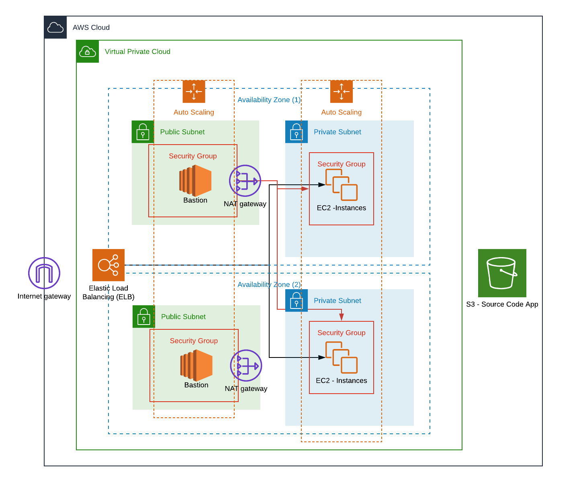
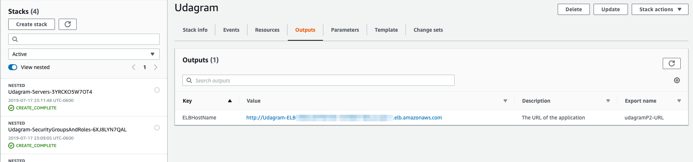

# Udagram - Project 2
This project contains the Cloud Formation templates used to deploy a High-Availability web application. Additionally, it contains a master Template which nested the other templates. 

## Overview

The project consists in an AutoScaling Group that will create EC2 instances with a webapp obtained froma S3 bucket. This instances are reached by a Load Balancer that will serve the application to the end users. Additionally, the project has an AutoScaling Group of Bastion servers that will help to reach the EC2 instaces so that you will be able to connect to the private subnet.

## Project Structure

### Templates
In this folder you can find all the Cloud Formation templates needed to generate the infrastructure. These templates are:

**networkingCF.yml**
This template creates the VPC, Private and Public Subnets, Internet Gateway, NATs and RouteTables needed for this schema.

**groupsRolesCF.yml**  
This template creates the security groups and roles used to the connectivity rules needed between servers.

**serversCF.yml**
This template creates the AutoScaling Groups (Webapp and Bastion servers), Load Balancer used in this project.

**masterTemplate.yml**
This template nested all the above templates in one keeping in mind the dependencies between each template, it will create the whole project.

### Parameters
In this folders you can find a parameter example file per template.

## How to use this project?
These are the steps used to create the infrastructure depicted in the Overview section:
1. Update with your information under the masterParameters.json file.
1. Run the script create-stack.sh

`./create-stack.sh`

In order to update the stack, you can use the update script as follow:

`./update-stack.sh`

## Tests
If you want to validate that the project is working as expected.

### How to validate the project is working?

1. Go to the Master Stack on the Outputs section you will find the output ** ELBHostName**. 

2. Open the URL in a browser.
3. Validate that the content that you have in the S3 is shown in the URL.

### How to validate the connectivity between bastion and the Webapp servers?
1. Add your AWS Key in your agent ssh client.

`ssh-add -k <key-file>.pem`

2. Connect to the bastion server with the **ubuntu** user, fordwarding the authentication agent connection.

`ssh -A ubuntu@<public-bastion-IP>`

3. Connect to the EC2 instances in the Private Subnet via the **ubuntu** user. 

`ssh ubuntu@<private-ec2-IP>`

4. Validate that the apache is working as expected.

`apachectl status`